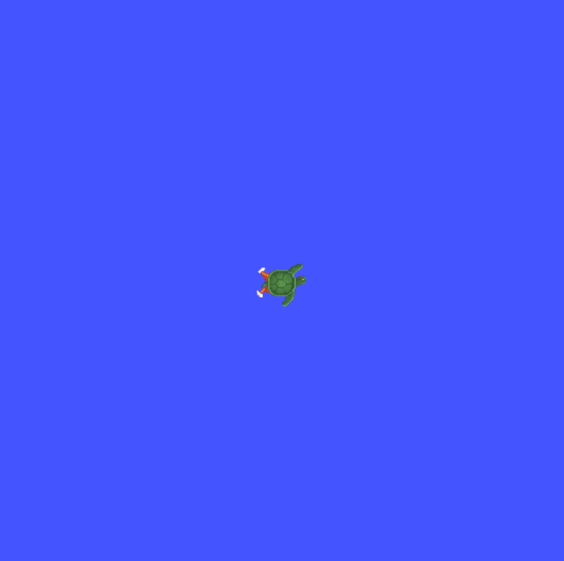
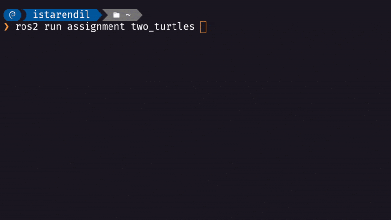
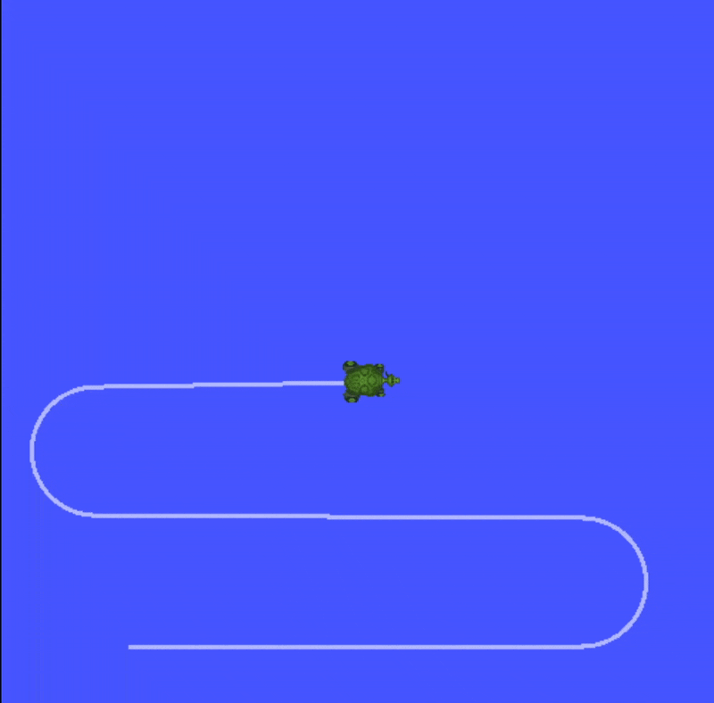
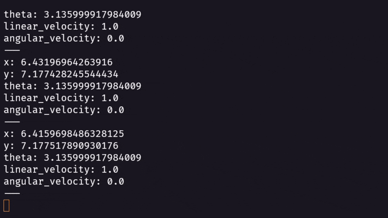

# Robot Programming with ROS - 2025

Assignments for the course **"Robot Programming with ROS - 2025"**, taught by **Prof. Carmine Tommaso Recchiuto**.

This repository contains the solutions for **two assignments** implemented in **ROS2** using **Python** and the **Turtlesim** simulator.

For each assignment, two GIFs are included to visually demonstrate the results:
- One shows the **GUI with the turtle(s) moving**.
- The other shows the **terminal execution**.

---

## 📘 Assignment 1 (ROS2)

The goal of this assignment is to implement a **UI node** with the following features:
- Spawn a new turtle in the environment: **turtle2**.
- Implement a simple textual interface to retrieve user commands (`input` in Python).  
  The user can:
  - Select which turtle to control (**turtle1** or **turtle2**).
  - Specify the velocity (linear, angular, or both).
- The command is sent for 1 second, after which the robot stops.  
  The user can then input a new command.
- Publish a custom message containing the string `"turtle2"` and the position of turtle2.

### 🔹 Demonstration

<p align="center">
  
  
</p>

---

## 📘 Assignment 2 (Mandatory in ROS2)

The second assignment extends the first one and must be done using **ROS2**.  
The tasks are:
- Call the service `kill` to remove **turtle1** and spawn a new turtle.
- Create a **publisher** and a **subscriber** for the new turtle (`cmd_vel` and `pose` topics).
- Check message types and add the needed dependencies.
- Add both a publisher and a subscriber node.
- Publish a certain velocity inside the callback.
- Create a **launch file** to start `turtlesim` and the controller.

### 🔹 Demonstration

<p align="center">
  
  
</p>

---

## 🛠️ Technologies
- ROS2  
- Python  
- Turtlesim package  

---

## 📂 Repository Organization

The `src/` folder contains two ROS2 packages:  

```text
src/
├── assignment/                     # Main ROS2 package
│   ├── two_turtles.py              # Assignment 1: UI and textual interface node to control turtle1 and turtle2
│   ├── trajectory_turtle.py        # Assignment 2: node to generate trajectories for the turtle
│   ├── launch/
│   │   └── launch_assignment.py    # Assignment 2: launch file for turtlesim and the controller
│   ├── package.xml                 # ROS2 package manifest
│   ├── setup.py / setup.cfg        # Build and installation configuration
│
├── assignment_msg/                 # Custom ROS2 message package
│   ├── msg/TurtleInfo.msg          # Assignment 1: custom message with turtle info
│   ├── CMakeLists.txt              # Build configuration for messages
│   └── package.xml                 # Message package manifest
│
```

This structure separates the logic nodes (assignment/) from the custom message definitions (assignment_msg/), following standard ROS2 practices.

## 🛠️ Technologies
- ROS2
- Python
- Turtlesim package

---

## 👤 Author
**Carlos Alberto Sánchez Delgado**
Student at **University of Genoa (UniGe) – IIT**, *Doctoral Program in Robotics and Intelligent Machines (DRIM)*.

